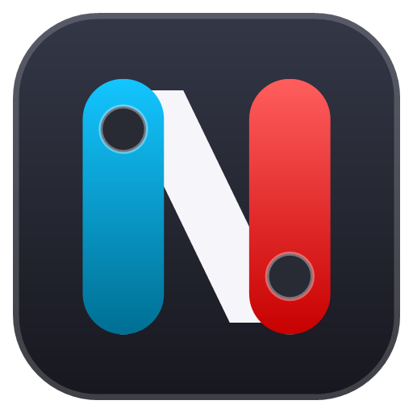

<div align="center">



# N-Connect

**Nintendo-, PlayStation- und Xbox-Controller am PC – einfach verbinden und spielen.**

[](https://github.com/DevCatSKZ/N-Connect/releases/latest)


[](LICENSE)


**Deutsch** · [English](README.en.md) · [Webseite](https://devcatskz.github.io/N-Connect/)


</div>

## Was ist N-Connect?

Viele Spiele unter Windows verstehen nur Xbox-Controller. **N-Connect übersetzt deinen Controller so, dass jedes
Spiel ihn erkennt** – egal ob Switch 2, Switch, Wii, PlayStation oder Xbox. Das funktioniert in Steam, im Xbox-/Game
Pass, bei Epic, in Emulatoren und in allen anderen Spielen mit Controller-Unterstützung.

Einmal installieren, Controller verbinden, spielen. N-Connect läuft unauffällig im Hintergrund.

## In 3 Schritten loslegen

| | |
|:---:|---|
| **1** | **Herunterladen und installieren** – [`N-Connect-Setup` von der Release-Seite](https://github.com/DevCatSKZ/N-Connect/releases/latest) laden und starten. Alles Nötige wird mitinstalliert. |
| **2** | **Controller verbinden** – meist reicht ein Druck auf die **SYNC-Taste** (siehe unten). |
| **3** | **Spielen** – der Controller funktioniert sofort in deinen Spielen. |

> [!TIP]
> **Windows zeigt eine Warnung „Der Computer wurde durch Windows geschützt“?** Das passiert bei neuen Programmen
> ohne teures Zertifikat. Klicke auf **Weitere Informationen → Trotzdem ausführen**. N-Connect ist Open Source –
> der komplette Quellcode liegt hier im Repository.

**Voraussetzungen:** Windows 10 oder 11 (64 Bit) und Bluetooth – oder ein USB-Kabel.

## Controller verbinden

| Controller | So geht's |
|---|---|
| **Switch 2** – Pro Controller, Joy-Con 2, GameCube | **SYNC-Taste** kurz drücken. Der Controller vibriert, wenn er verbunden ist. Pro Controller und GameCube gehen auch per **USB-Kabel**. |
| **Switch** – Pro Controller, Joy-Con, NES, SNES, N64, Mega Drive | **SYNC-Taste** drücken, bis die Lichter laufen. N-Connect koppelt den Controller selbst. |
| **Wii-Fernbedienung, Wii U Pro Controller** | **Rote SYNC-Taste** drücken (Wii-Fernbedienung: im Batteriefach, Wii U Pro: auf der Unterseite). |
| **PlayStation** – DualShock 4, DualSense | Einmal in den **Windows-Bluetooth-Einstellungen** koppeln oder per **USB-Kabel** anschließen. |
| **Xbox** | Einfach anschließen – per USB, Bluetooth oder Xbox-Wireless-Adapter. |

Danach reicht beim nächsten Mal **ein beliebiger Tastendruck** zum Verbinden.

> [!IMPORTANT]
> **Switch-2-Controller nicht in den Windows-Bluetooth-Einstellungen hinzufügen** – das stört die Verbindung.
> Einfach nur die SYNC-Taste drücken. Möchtest du den Controller danach wieder an der Switch 2 benutzen, dort
> einmal neu koppeln.

## Das kann N-Connect

- 🎮 **Funktioniert in jedem Spiel** – dein Controller erscheint als Xbox-Controller (oder als PlayStation-Controller
  mit Bewegungssteuerung).
- 👥 **Bis zu 8 Controller gleichzeitig** – du legst fest, wer Spieler 1, 2, 3 … ist.
- 🔋 **Akkustand immer im Blick** – mit Warnung, bevor der Akku leer ist.
- ⌨️ **Tasten frei belegen** – auch mit Tastatur, Maus, Turbo oder ganzen Tastenfolgen. Eigene Profile je Spiel.
- 🎯 **Zielen durch Bewegen** – die Bewegungssensoren steuern Kamera oder Maus, ideal für Shooter.
- 🕹️ **Joy-Con wie an der Switch** – als Paar oder einzeln, quer oder hochkant.
- 🩹 **Stick-Drift beheben** – Sticks einfach neu ausmessen.
- 🧪 **Controller testen** – Sticks, Trigger, Bewegungssensoren und Tasten live prüfen, z. B. beim Gebrauchtkauf.
- 🖱️ **Desktop-Modus** (zum Einschalten) – läuft kein Spiel, steuert der Controller Maus und Tastatur. Ideal für den
  PC am Fernseher.
- 🔄 **Updates mit einem Klick** – N-Connect meldet sich, wenn es eine neue Version gibt.
- 🌍 **12 Sprachen** und ein **Design wie Windows 11** – hell, dunkel und vier weitere Farbschemata.

<details>
<summary><b>Alle Funktionen im Detail</b></summary>

### Übersicht
- Live-Grafik jedes Controllers – gedrückte Tasten leuchten, Sticks bewegen sich mit.
- Statusleiste: verbundene Controller, Bluetooth, niedrigster Akku, wie Spiele die Controller sehen.
- Ansicht **Groß** oder **Kompakt** (bis zu vier Controller nebeneinander).
- Knöpfe je Controller: **Vibrieren** (welcher ist welcher?), **Trennen**, **Einstellungen** nur für diesen Controller.
- Controller umbenennen, z. B. „Lenas Joy-Con“.

### Tasten und Profile
- Jede Taste auf Controller-Tasten, **Tastatur-Kürzel**, **Maustasten**, **Turbo** oder **Makros** legen –
  oder auf fertige Vorlagen wie Bildschirmfoto, Aufnahme, Xbox Game Bar oder Lautstärke.
- Taste per Tastendruck belegen: Tastatur-Symbol neben der Taste anklicken und die gewünschte Taste drücken.
- **Shift-Ebene:** Solange eine Taste gehalten wird, haben die anderen Tasten eine zweite Belegung.
- **Profile je Spiel** werden automatisch aktiv, sobald das Spiel im Vordergrund ist – auch als Datei teilbar.

### Bewegung und Sticks
- **Gyro als rechter Stick** – immer, nur beim Zielen oder per Taste. Geführter Gyro-Assistent mit Vorschau.
- **Gyro als Maus**, Flick-Stick und weitere Extras für Shooter.
- **Sticks kalibrieren** gegen Drift (nur in N-Connect gespeichert, der Controller bleibt unverändert).
- Totzone, Empfindlichkeitskurve, Trigger-Schwellen und Vibrationsstärke – allgemein oder je Controller.
- Bewegungsdaten für Emulatoren wie Cemu und Dolphin (Cemuhook/DSU).

### Joy-Con und Wii
- Zwei Joy-Con werden automatisch ein Controller; quer halten und SL oder SR drücken macht einen Joy-Con zum eigenen
  Spieler, L + R gleichzeitig verbindet wieder.
- **Joy-Con 2 als Maus:** auf die Schienenkante stellen.
- amiibo lesen, Ring-Con und IR-Kamera (Switch-Joy-Con), Nunchuk und Classic Controller (Wii).

### Desktop-Modus (unter *Allgemein*, standardmäßig aus)
- Läuft kein Spiel, steuert der Controller Windows: linker Stick = Maus, rechter Stick = Scrollen, A = Klick,
  B = Rechtsklick, X = Taskansicht, Y = Bildschirmtastatur, Steuerkreuz = Pfeiltasten, LB/RB = zurück/vor,
  Start = Enter, Back = Esc, HOME = Startmenü, RT halten = präziser Zeiger.
- In Vollbildspielen und Programmen mit eigenem Profil automatisch aus. **Back + Start** 1 Sekunde halten pausiert ihn.

### Komfort
- Startet mit Windows unsichtbar im Infobereich; Menü dort mit Vibrieren, Spielerplatz und Trennen je Controller.
- Einblendung beim Verbinden (Spieler, Controller, Akku – abschaltbar), Meldung beim Trennen, automatisches Trennen
  nach Inaktivität (spart Akku).
- **Controller testen** (Reiter „Test“ an jeder Karte): Sticks mit Rundheitsanzeige, Trigger, Bewegungssensoren,
  Tasten, Berichtsrate, Vibration.
- Fertige Tastenvorlagen, z. B. für die C-Taste: Mikrofon stumm, Discord stumm/taub, Desktop anzeigen, Titel vor/zurück.
- **Diagnose exportieren** (*Allgemein → Erweitert*): Protokoll und Systeminfos als ZIP für Fehlermeldungen.
- Original-Controller werden vor Steam und Spielen versteckt, damit kein Controller doppelt erscheint.
- Kopplungsdaten von der Switch übernehmen oder auf einen anderen PC übertragen.
- Gut lesbar bei jeder Bildschirmskalierung (100 % bis 200 %).

</details>

## Unterstützte Controller

| Controller | USB-Kabel | Bluetooth | Besonderheiten |
|---|:---:|:---:|---|
| Switch 2 Pro Controller | ✅ | ✅ | Gyro, HD-Vibration, Zusatztasten GL/GR/C |
| Joy-Con 2 | – | ✅ | als Paar oder einzeln, Mausmodus |
| GameCube-Controller (Switch 2) | ✅ | ✅ | analoge Trigger |
| Switch Pro Controller | ✅ | ✅ | Gyro, Vibration, amiibo |
| Joy-Con (Switch) | Ladegriff | ✅ | amiibo, Ring-Con, IR-Kamera |
| NES · SNES · N64 · Mega Drive (Nintendo Switch Online) | – | ✅ | originale Tastenanordnung |
| Wii-Fernbedienung (auch Plus) | – | ✅ | mit Nunchuk oder Classic Controller |
| Wii U Pro Controller | – | ✅ | |
| DualShock 4 · DualSense · DualSense Edge | ✅ | ✅ | Touchpad, Gyro, Lichtleiste |
| Xbox 360 · One · Series · Elite | ✅ | ✅ | läuft direkt, N-Connect zeigt Akku und Belegung |
| Kabel-Controller von HORI, PowerA, PDP; Nachbauten (z. B. 8BitDo) im Switch-Modus | ✅ | je nach Modell | |

> [!NOTE]
> **Hast du einen Kabel-Controller von HORI, PowerA oder PDP?** Diese Modelle sind noch nicht mit echter Hardware
> getestet. Bitte [kurz melden](https://github.com/DevCatSKZ/N-Connect/issues), ob deiner funktioniert – am besten mit
> *Allgemein → Erweitert → Diagnose exportieren*.

> [!NOTE]
> **Viele Controller gleichzeitig?** Einfache Bluetooth-Sticks schaffen oft nur 2–3 Controller. Für mehr empfiehlt
> sich ein guter Adapter (z. B. Intel AX200/AX210 oder ein Bluetooth-5.3-Stick).

## Hilfe bei Problemen

<details>
<summary><b>Der Switch-2-Controller verbindet sich nicht</b></summary>

SYNC-Taste nur **kurz** drücken, nicht halten. Steht der Controller in den Windows-Bluetooth-Einstellungen, dort
**entfernen**. Eine Switch 2 in der Nähe am besten in den Ruhemodus versetzen, damit sie den Controller nicht übernimmt.
</details>

<details>
<summary><b>Ein Switch-, Wii- oder NSO-Controller wird nicht gefunden</b></summary>

In N-Connect auf **„Controller suchen …“** klicken und dann die SYNC-Taste drücken, solange gesucht wird. Die
automatische Suche pausiert, während jemand spielt.
</details>

<details>
<summary><b>Steam oder ein Spiel zeigt einen Controller doppelt</b></summary>

Unter **Allgemein → Original-Controller verstecken** einschalten, die Windows-Abfrage bestätigen und Steam einmal neu
starten.
</details>

<details>
<summary><b>Ein Joy-Con ist plötzlich ein eigener Spieler</b></summary>

Er wurde vom Paar gelöst (quer gehalten und SL/SR gedrückt). **L** am linken und **R** am rechten Joy-Con
gleichzeitig drücken – schon sind sie wieder ein Paar.
</details>

<details>
<summary><b>Meldung „ViGEmBus-Treiber fehlt“</b></summary>

Das Setup einfach noch einmal ausführen. Der Treiber sorgt dafür, dass Spiele den Controller sehen.
</details>

<details>
<summary><b>Etwas anderes funktioniert nicht</b></summary>

Unter **Allgemein → Erweitert → Diagnose exportieren** eine ZIP-Datei erstellen und bei einer
[Fehlermeldung](https://github.com/DevCatSKZ/N-Connect/issues) anhängen. Sie enthält Protokoll, Einstellungen und
Systeminfos, aber keine Kopplungsschlüssel.
</details>

## Portable Version

Lieber ohne Installation? Auf der [Release-Seite](https://github.com/DevCatSKZ/N-Connect/releases/latest) gibt es
**`N-Connect-Portable-….zip`**: entpacken und `N-Connect.exe` starten. Einstellungen bleiben im Ordner neben dem
Programm. Die beiden Treiber [ViGEmBus](https://github.com/nefarius/ViGEmBus/releases) und
[HidHide](https://github.com/nefarius/HidHide/releases) müssen auf dem PC trotzdem einmal installiert sein.

<details>
<summary><b>Für Entwickler: Technik und selbst bauen</b></summary>

N-Connect spricht die Controller direkt an (Bluetooth LE über WinRT, HID, WinUSB) und gibt die Eingaben an
[ViGEmBus](https://github.com/nefarius/ViGEmBus) weiter, einen signierten Treiber für virtuelle Xbox-360- bzw.
DualShock-4-Controller. [HidHide](https://github.com/nefarius/HidHide) versteckt die Original-Controller vor Spielen.
Ausführliche Dokumentation (Funktionen, Architektur, Protokolle): **[docs/](docs/README.md)**.

```
src/Switch2Pro.Protocol   Protokolle (plattformunabhängig, mit Tests)
src/Switch2Pro.Bridge     Windows-App: Verbindungen, virtuelle Controller, Oberfläche, Übersetzung
tests/                    xUnit-Tests
installer/                Inno-Setup-Skript
```

**Bauen** (.NET 8 SDK):
`dotnet test` und
`dotnet publish src/Switch2Pro.Bridge -c Release -r win-x64 --self-contained -p:PublishSingleFile=true -o out/publish/win-x64`.
Setup lokal: Inno Setup 6, dann `ISCC.exe installer\N-Connect.iss`. Releases baut der Workflow
`.github/workflows/build.yml` automatisch beim Setzen eines Tags `v…`.

**Prüfhilfen:** `N-Connect.exe --render-ui <Ordner>` erzeugt Bilder aller Seiten (läuft auf einem unsichtbaren
Desktop; Schalter `--demo`, `--demo-all`, `--light`, `--lang=xx`, `--scheme=xx`, `--scale=1.5`, `--compact`,
`--wide`). `--render <Ordner>` zeichnet alle Controller-Grafiken, `--render-brand <Ordner>` Icon und
Installer-Bilder.

Dateien: Protokoll `%LOCALAPPDATA%\N-Connect\bridge.log`, Einstellungen `%APPDATA%\N-Connect\settings.json`.

**Quellen und Dank** (Protokollinformationen, eigene Umsetzung):
[ndeadly/switch2_controller_research](https://github.com/ndeadly/switch2_controller_research), SDL (zlib),
dekuNukem/Nintendo_Switch_Reverse_Engineering, Linux `hid-nintendo` und `hid-wiimote`, WiiBrew, yuzu/Citron,
Dolphin, Switch2Connect, NS2Pro-Bridge-Windows (MIT). Virtuelle Controller: ViGEmBus und HidHide von Nefarius.
</details>

## Lizenz

[MIT](LICENSE) © **devcatskz** – kostenlos, Open Source.

Inoffizielles Projekt, nicht mit Nintendo, Sony oder Microsoft verbunden. „Nintendo“, „Switch“, „Wii“, „amiibo“ sind
Marken von Nintendo; „PlayStation“, „DualShock“, „DualSense“ von Sony; „Xbox“ von Microsoft; „SEGA“ und „Mega Drive“
von SEGA.
